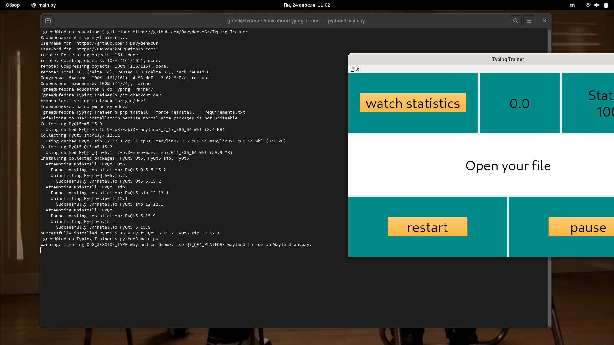
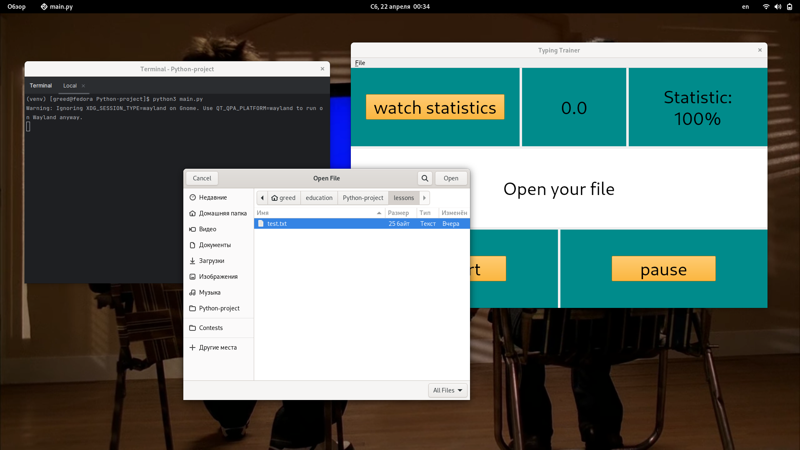
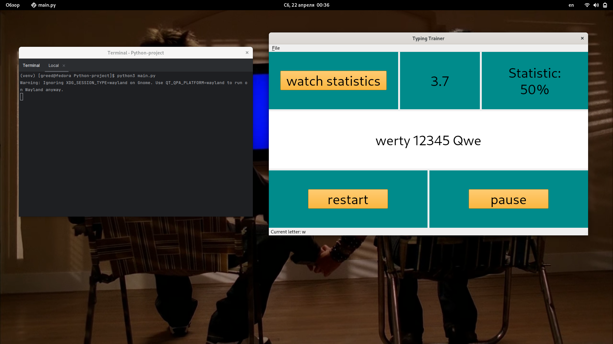
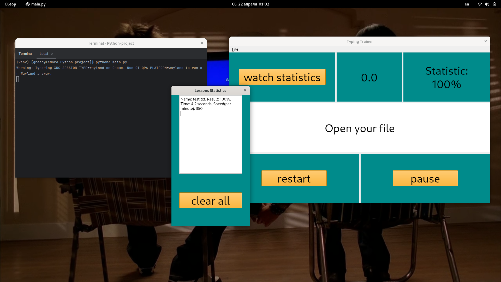

# Typing Trainer
### About project
Typing Trainer is a printing simulator that allows the user to improve his skills in fast printing.
### Requirements

- python version 3+
- installed libraries from requirements.txt

### Start application
Clone project using https://github.com/DavydenkoGr/Typing-Trainer  
Run command

- python{your_python_version} main.py  

Open lessons from lessons folder or make your own (notice, your lesson should match specific requirements)
### Usage example

  
  
  

### Authors:
- Davydenko Grigorii
  - GitHub: @DavydenkoGr
  - Telegram: @desertSmoke42
